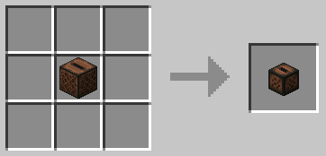

# Heads of Gluttony

Heads of Gluttony is a Minecraft datapack that lets you craft powerful, wearable heads that gain unique abilities when you devour the right items.  
Each head has its own purpose and can be upgraded as you consume specially crafted materials.

## 🎵 Jukebox Head

> “Music is great, but why stop moving to listen?”

With the Jukebox Head, you can eat music discs to listen to them while traveling.
Fear not, your discs aren’t lost!
- Eat another disc to replace the one currently playing.
- Remove it by clicking while wearing the head.

## 💎 Beacon Head

> “Why build a beacon pyramid when you can become one?”

The Beacon Head grants you a personal beacon-like aura that follows you wherever you go.
It’s fully upgradable using special crafted materials.

Newly crafted heads start at Level 0.

### Upgrading

To upgrade your head, you must craft and eat Heavy Blocks.
These must be consumed in the correct order, as each tier increases your head’s level.
Each new level unlocks an additional effect slot, allowing you to store more active powers.

#### Heavy Block of Iron (Level 1)

#### Heavy Block of Gold (Level 2)

#### Heavy Block of Emerald (Level 3)

#### Heavy Block of Diamond (Level 4)

#### Heavy Block of Netherite (Level 5)

At this level, your head also becomes invulnerable to lava.

### Activating Effects

To activate effects, you’ll need Infused Heavy Cores.
Use a Smithing Table to combine a Heavy Core with a specific material to infuse it.

- Each infused core grants a unique effect when eaten.
- Some effects can stack up to level II.
- The Heavy Core is returned after eating an Infused Core (but not when upgrading the head).

#### Fire Resistance Core

#### Haste Core

#### Jump Boost Core

#### Night Vision Core

#### Regeneration Core

#### Resistance Core

#### Speed Core

#### Strength Core

#### Water Breathing Core

